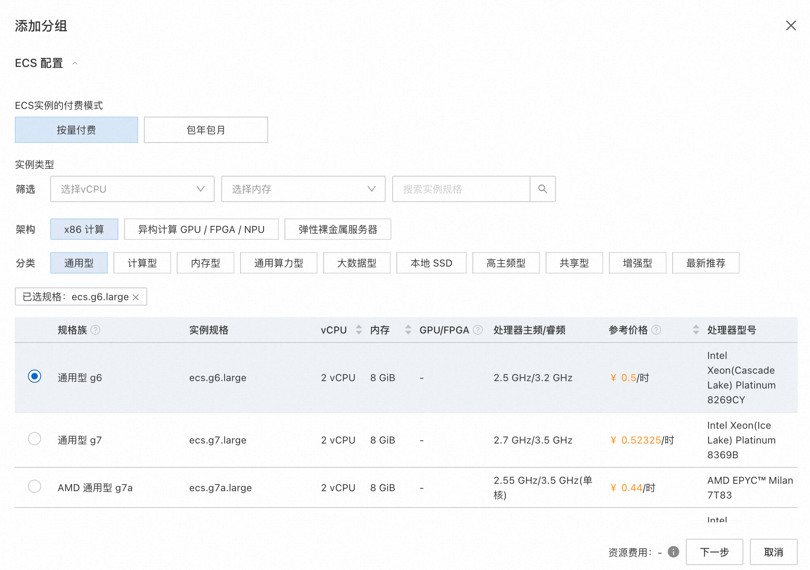
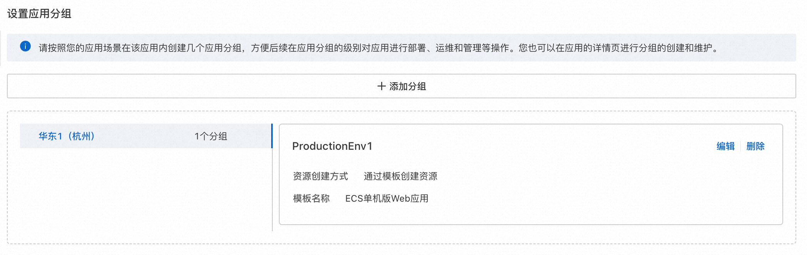
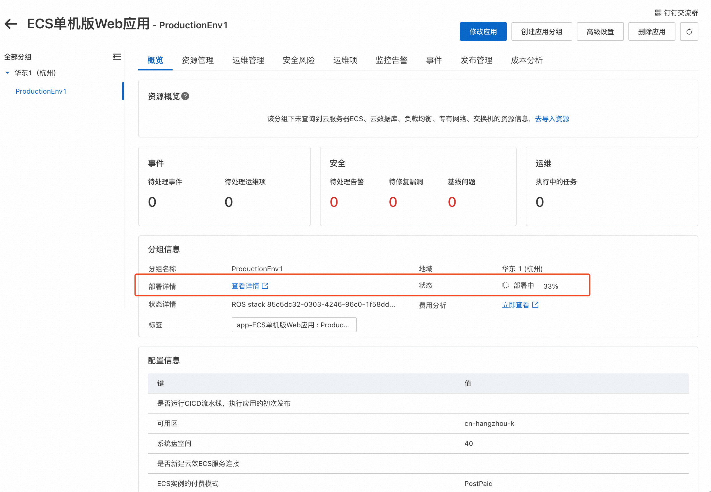
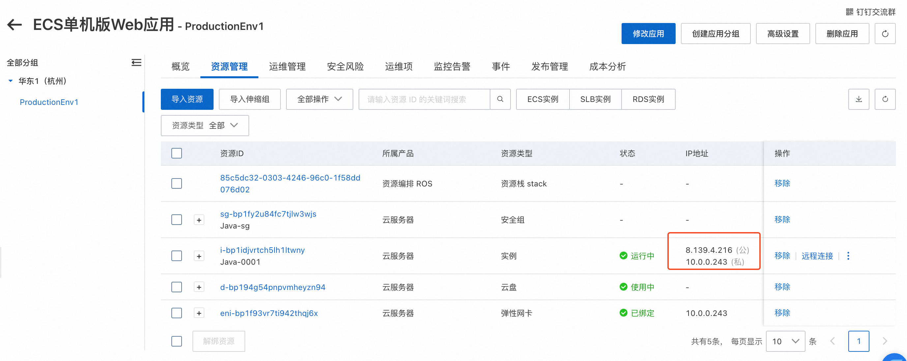
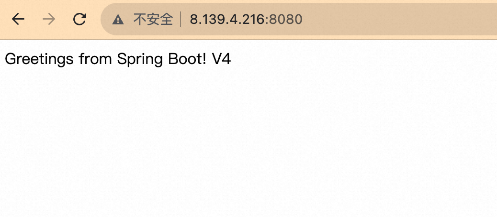

# ECS单机版Web应用说明文档

## 概述
ECS单机版Web应用模板提供了快速体验应用管理的最小化HelloWorld Web应用。
部署此应用时，用户只需要选择示例软件并输入ECS实例密码等少量参数，即可一键部署运行环境并设置好代码的持续集成和持续部署。

部署完成的应用分组包含一个ECS实例、一个从示例代码源编译并发布应用到ECS实例上的CICD流水线，并自动触发一次初始发布。
待应用部署完成且流水线执行成功时，Web服务已经访问。

您可以在发布页修改流水线中的代码源为您自己的代码，重新发布后即可部署您自己的应用代码。

## 计费说明
部署此应用的费用主要涉及：

- 所选vCPU与内存规格
- 磁盘容量
- 公网带宽

计费方式包括：

- 按量付费（小时）
- 包年包月

预估费用在部署前可实时看到。

## RAM账号所需权限
若您使用RAM用户创建应用，为了使用应用管理的完整功能，需要对使用的RAM用户的账号添加相应资源的权限。添加RAM权限的详细操作，请参见[为RAM用户授权](https://help.aliyun.com/document_detail/455313.html)。

为了部署此应用，所需权限如下表所示。

| 权限策略名称 | 备注 |
| --- | --- |
| AliyunECSFullAccess | 管理云服务器服务（ECS）的权限 |
| AliyunVPCFullAccess | 管理专有网络（VPC）的权限 |
| AliyunROSFullAccess | 管理资源编排服务（ROS）的权限 |
| AliyunCloudMonitorFullAccess | 管理云监控（CloudMonitor）的权限 |
| AliyunRDCFullAccess | 管理云效的权限 |

## 部署流程
### 访问应用管理
应用管理可以从三个入口访问：

- [ECS控制台入口](https://ecs.console.aliyun.com/app/list)
- [系统管理与运维服务OOS入口](https://oos.console.aliyun.com/app/list)
- [计算巢入口](https://computenest.console.aliyun.com/app/list)

### 部署步骤
1. 访问应用管理控制台，点击“创建应用”后选择“通过模板创建”，在选择“ECS单机版Web应用”模板，点击“使用模板”
2. 输入应用名称、应用描述后，点击“添加分组”
3. 输入部署参数，保存分组。保存前可以预览费用明细和参数。

4. 输入应用高级设置后，点击创建

### 部署参数说明
您在创建服务实例的过程中，需要配置服务实例信息。下文介绍stable-diffusion服务实例输入参数的详细信息。

| 参数组     | 参数项    | 示例           | 说明                                                                        |
|---------|--------|--------------|---------------------------------------------------------------------------|
| 应用CICD配置 |  示例应用        | Java         | 选择不同编程语言的Web服务示例应用                                                                     |
|  应用CICD配置      | 云效企业      | 企业名      | 默认使用当前账号绑定的云效企业。如果未绑定请在OOS全局配置->发布配置中绑定云效企业 |
|  应用CICD配置      | 是否新建云效ECS服务连接      | 是      | 是否以当前账号权限创建云效ECS服务连接，云效使用服务连接在ECS实例上部署 |
|  应用CICD配置      | 是否运行CICD流水线      | 是      | 是否运行一次CICD流水线，执行应用的初次发布 |
| ECS配置  | 付费类型   | 按量付费 或 包年包月  |
| ECS配置 | 实例类型   | ecs.g6.large | 实例规格，可以根据实际需求选择                                                           |
| ECS配置 | 流量付费类型   | 按使用流量 | 实例规格，可以根据实际需求选择                                                           |
| ECS配置 | 实例公网带宽   |   10M   | 出公网最大带宽|
| ECS配置 | 系统盘类型   |  cloud_essd    | |
| ECS配置 | 系统盘大小   |  120GB    | |
| ECS配置 | 实例密码   |      | 登录密码|
| 可用区配置 | 可用区   |  杭州可用区K    | |
| 网络配置    | 是否新建VPC  | 是     | 是否创建一个新VPC
| 网络配置    | 专有网络IPv4网段  | 192.168.0.0/16     | VPC的ip地址段范围                                                               |
| 网络配置    | 交换机子网网段   | 192.168.0.0/24     | 交换机子网网段                                                                   |
| 网络配置    | 现有VPC的实例ID   | vpc-xxx     |                                                                    |
| 网络配置    | 现有网络交换机ID   | vsw-xxx     |                                                                    |

### 验证结果

1. 查看应用。应用创建成功后，环境部署时间大约需要1分钟。状态变为“已部署”即为部署完成。

2. 部署完成后，会自动进行首次的应用发布。

点击流水线名称可以看到流水线状态。

3. 发布完成后，通过访问http://公网IP:8080即可访问HelloWorld示例服务

4. 编辑流水线，可以替换代码源为您自己的应用代码源。重新发布后，就可以访问您自己的服务了。
注意如果您的服务使用了8080外的其他端口，需要在安全组中放开该端口的入方向访问。在资源管理中可以找到安全组，点击修改安全组规则。